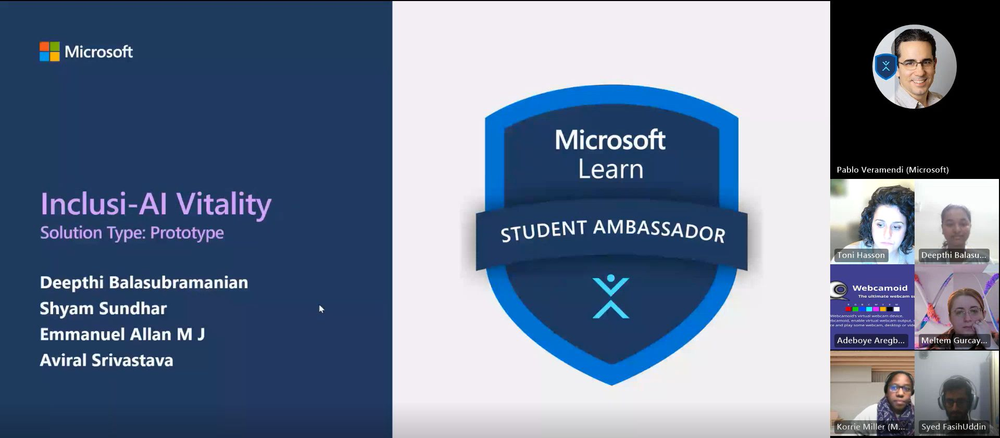
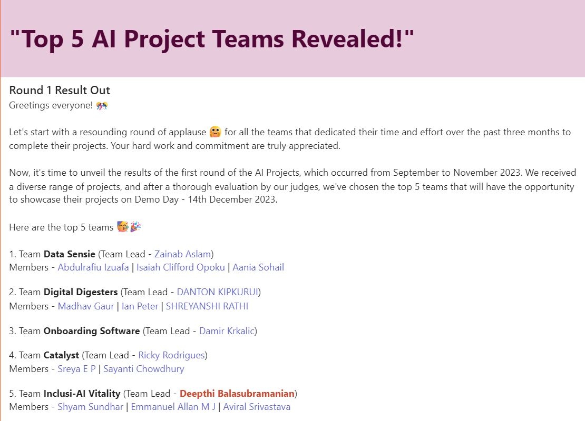

# Inclusi-AI-Vitality | Mental Well-being App

A comprehensive mental well-being app developed by Team Inclusi-AI Vitality, harnessing Flask, Next.js, OpenAI API, and Azure services. The app aims to provide personalized support for emotional well-being through features such as a conversational chatbot, personalized recommendations, mood tracking, and a secure user experience.

## Project Overview

This open-source project emerged from the Microsoft Learn Student Ambassadors Project cohort, where Team Inclusi-AI Vitality collaborated to harness AI for real-world mental health challenges. The app integrates cutting-edge technologies, including Flask for the backend, Next.js for the frontend, OpenAI API for conversational AI, and Azure services for cloud hosting.

  

## Key Features

| Feature                 | Description                                                                                                  |
|-------------------------|--------------------------------------------------------------------------------------------------------------|
| Conversational Chatbot  | Engage in meaningful conversations with the sophisticated chatbot powered by OpenAI API's GPT-3 model.        |
| Personalized Recommendations | Receive tailored suggestions for mental well-being resources based on user preferences and needs.          |
| Mood Tracking           | Record daily moods to identify patterns and gain insights into emotional well-being.                          |
| Secure User Experience   | Utilizes Azure App Service and Azure Database for PostgreSQL to ensure secure storage and data privacy.        |

 ## Achievements and Project Demo
- *Team Inclusi-AI Vitality:* A dynamic team dedicated to leveraging AI for mental well-being solutions during the Microsoft Learn Student Ambassadors Project cohort from September to November 2023. Our commitment to innovation and user support led us to develop a functional prototype, showcasing our dedication to making a positive impact on users.
- Explore the app by accessing the [deployed frontend app's URL](https://vitalityapp.azurewebsites.net/). Interact with the chatbot, utilize mood tracking, and explore personalized recommendations.
- You can watch the [project demo here](https://www.youtube.com/watch?v=4YFudJ-0B2s).

  

  

## Statistics on Mental Health

Here are some compelling statistics highlighting the importance of addressing mental health:

- Approximately 450 million people worldwide suffer from mental health disorders.
- Depression affects more than 264 million people, making it the leading cause of disability globally.
- Suicide is the second leading cause of death among individuals aged 15-29.
- Mental health conditions account for 16% of the global burden of disease and injury.
- Only 1 in 5 people with mental health disorders receive adequate treatment.

## Technologies Used

- **Backend:** Flask
- **Frontend:** Next.js
- **Conversational AI:** OpenAI API
- **Cloud Hosting:** Azure App Service
- **Database:** Azure Database for PostgreSQL

## Development Setup

1. **Prerequisites:**
    - Node.js
    - Python
    - Azure CLI

2. **Backend Setup:**
    - Install dependencies: `pip install -r requirements.txt`
    - Run the backend server: `python app.py`

3. **Frontend Setup:**
    - Install dependencies: `npm install`
    - Run the frontend server: `npm run dev`

4. **Deployment:**
    - Create an Azure App Service and deploy the backend code.
    - Create an Azure App Service and deploy the frontend code.
    - Configure a custom domain for the frontend app.

## Contribution Guidelines

We value and welcome contributions to enhance the Inclusi-AI-Vitality app. To contribute, follow these guidelines:

1. **Create a Pull Request:**
    - Fork the repository, create a feature branch, and submit a pull request.

2. **Code Quality:**
    - Adhere to the existing coding style and conventions.
    - Ensure your code is well-documented, and use meaningful variable and function names.

3. **Testing:**
    - Thoroughly test your changes locally before submitting a pull request.
    - Include test cases when adding new features.

4. **Feature Proposals:**
    - For significant changes or new features, create an issue to discuss the proposal before implementation.

5. **Documentation:**
    - Provide clear and concise documentation for any new features or changes.
    - Update the README with relevant information about your contributions.

6. **Communication:**
    - Engage in discussions on GitHub issues.
    - Be responsive to feedback and questions related to your pull request.

7. **License Agreement:**
    - Ensure your contributions comply with the project's MIT License.

## License

This project is licensed under the MIT License.

---
